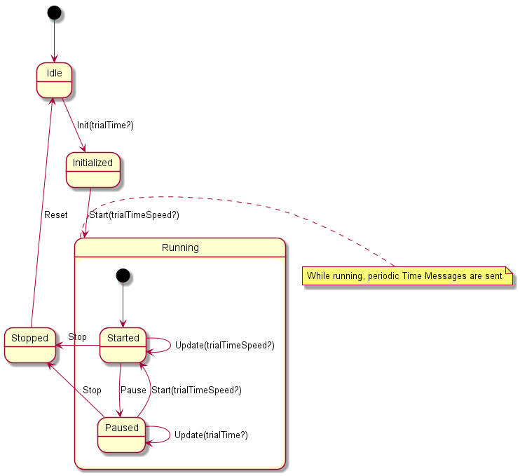

# test-bed-time-service

In the test-bed, there will be one or more simulations that, together, create a virtual incident and reasonable responses of the environment. For example, there may be a flooding simulation or earthquake, after which the traffic (simulation) is disturbed too.

UingThe test-bed time service can be controlled via Apache Kafka and via a GUI available at [http://localhost:8100/time-service](http://localhost:8100) (see screenshots below). It listens to state changes of the test-bed, e.g. scenario start and stop messages.

In particular, this service will publish the fictive time, the real time, the speed of the simulation and its state at least every 5 seconds, and after a change of the fictive time status (e.g. a speed change, or pause/stop of the simulation). The time message will be described in AVRO, as detailed in the [avro-schemas repository](https://github.com/DRIVER-EU/avro-schemas/blob/master/core/time/connect-status-time-value.avsc), and contains:

- Real time (or actual UTC time without time-zones or summer-winter time)
- Fictive time (also as UTC time)
- Elapsed time (the time that the simulation was in play state, expressed in msec.)
- Scenario speed
- Simulation state, e.g. Idle, Started, etc.

The service may be combined with an NTP service to get the real time.

The partially hidden menu in the top left corner can also be used to control the fictive time.

## Build instructions

This assumes you have Node.js installed, node-gyp (`npm i -g node-gyp`) and python v2.7.

- Check out the repository
- Run `npm i`

In order to build and run it, a local version of the Test-bed must be running.

- Run `npm start`, which starts the server and [GUI](http://localhost:8100/time-service) locally.

There are two packages, a server and a GUI, which are build and run in parallel.

## Running

- Run `npm run start-tno-testbed` to run a time service for the driver-testbed.eu
- Run `npm run start-local` to run a time service for a localhost testbed.
- OR Run `npm run start -- -k <kafka broker host:port> -s <schema registry host:port>`

Alternatively, you can install the time-service from [npmjs.com](https://npmjs.com) `npm i -g time-service`.

## Configuration

The following properties can be configured. Either via Environment Variables, or via Command line parameters. Command line parameters will override the Environment Variables.

### Environment Variable Configuration

| Variable                             | Description                                                | Default value                 |
| ------------------------------------ | ---------------------------------------------------------- | ----------------------------- |
| `KAFKA_BROKER_URL=<value>`           | Kafka Broker address, e.g. localhost:3501                  | driver-testbed.eu:3501        |
| `SCHEMA_REGISTRY_URL=<value>`        | Schema Registry URL, e.g. http://localhost:3502            | http://driver-testbed.eu:3502 |
| `AUTO_REGISTER_SCHEMAS=<true/false>` | Automatically register all schemas in the ./schemas folder | false                         |
| `PORT=<value>`                       | Endpoint port, e.g. http://localhost:PORT/time             | 8100                          |
| `INTERVAL=<value>`                   | Default time interval between time messages in msec.       | 5000                          |

## Command Line Parameter Configuration

| Command Line Parameter                   | Description                                                                | Default value                 |
| ---------------------------------------- | -------------------------------------------------------------------------- | ----------------------------- |
| `-h` or `--help`                         | Show help text                                                             |                               |
| `-v` or `--version`                      | Show version number                                                        |                               |
| `-k` or `--kafkaHost <value>`            | Kafka Broker address, e.g. localhost:3501                                  | driver-testbed.eu:3501        |
| `-s` or `--schemaRegistryUrl <value>`    | Schema Registry URL, e.g. http://localhost:3502                            | http://driver-testbed.eu:3502 |
| `-a` or `--autoRegisterSchemas`          | Automatically register all schemas in the ./schemas folder                 | false                         |
| `-p` or `--port <value>`                 | Endpoint port, e.g. http://localhost:PORT/time                             | 8100                          |
| `-i` or `--interval <value>`             | Default time interval between time messages in msec.                       | 5000                          |
| `-b` or `--billboard <PARTICIPANT_NAME>` | Displays role-player messages of type `message` to `billboard` participant |                               |

## Usage

The Test-bed Time Service acts as a state machine following the diagram below:

State transitions can be triggered by sending Time Control messages via Kafka. These messages are described in AVRO, as detailed in the [avro-schema-repository](https://github.com/DRIVER-EU/avro-schemas/blob/master/core/time/connect-status-time-control-value.avsc).

### Idle to Initialized

Send a TimeControl message of type 'Init'. Optionally provide the 'simulationTime' which will be the fictive starting time. If not provided this will default to the current real-time upon transitioning to the 'Started' state.

### Initialized to Started

Send a TimeControl message of type 'Start'. Optionally provide the 'simulationSpeed' which will be the speed factor applied to the real-time to compute the fictive time (i.e. with a simulationSpeed of 2.0 every second passed in real-time will equal 2 seconds passed in fictive time). If not provided this will default to 1.0.

This will start the periodic transmission of Time Messages by the Time Service.

### Started to Paused

Send a TimeControl message of type 'Pause'. This will effectively set the simulationSpeed to 0.0

### Paused to Started

Send a TimeControl message of type 'Start'. Optionally provide the 'simulationSpeed' which will be the speed factor applied to the real-time to compute the fictive time (i.e. with a simulationSpeed of 2.0 every second passed in real-time will equal 2 seconds passed in fictive time). If not provided this will default to 1.0.

### Paused or Started to Stopped

Send a TimeControl message of type 'Stop'.

This will stop the periodic transmission of Time Messages by the Time Service.

### Stopped to Idle

Send a TimeControl message of type 'Reset'. You may now re-initialize the Time Service for a new run.

### Updating Trial Time Speed while Started

While running, the Trial Time Speed may be changed via an Update message containing the 'simulationSpeed' property that contains a speed factor applied to the real-time.

### Updating Trial Time while Paused

While paused, the Trial Time may be changed via an Update message containing the 'simulationTime' property that contains the new time as a UTC timestamp.

### Billboard messages

The time server GUI can also act as a simple billboard for messages that are sent as RolePlayerMessages (of type `message`) to the participant with the same name. So if you have started the service using `-b BILLBOARD`, all role player messages to the `Billboard` (case-insensitive) participant will be displayed in the GUI. This makes it easy to send out messages to all participants that watch the time.
