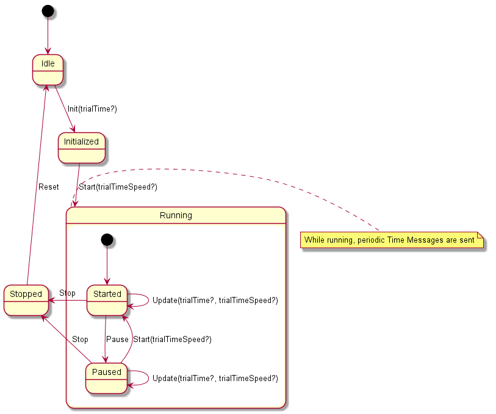

# test-bed-time-service

## Introduction
In the test-bed, there will be one or more simulations that, together, create a virtual incident and reasonable responses of the environment. For example, there may be a flooding simulation or earthquake, after which the traffic (simulation) is disturbed too.

The test-bed time service can be controlled via Apache Kafka. It listens to state changes of the test-bed, e.g. scenario start and stop messages.

In particular, this service will publish the fictive time, the real time, and speed of the simulation at least every 5 seconds, and after a change of the fictive time status (e.g. a speed change, or pause/stop of the simulation). The time message will be described in AVRO, as detailed in the [avro-schemas repository](https://github.com/DRIVER-EU/avro-schemas/blob/master/core/time/connect-status-time-value.avsc), and contain:
- Real time (or actual UTC time without timezones or summer-winter time)
- Fictive time (also as UTC time)
- Scenario duration (the time that the simulation was in play state, expressed in msec)
- Scenario speed

It may also check whether there are (simulation) services that are lagging behind, e.g. by requiring a response ("I'm done"). In case a simulation cannot keep up, the whole scenario needs to be slowed down (either pause or slowdown the total simulation).

The service will be combined with an NTP service to get the real time.

## Usage 

The Test-bed Time Service acts as a state machine following the diagram below:

State transitions can be triggered by sending Timing Control messages via Kafka. These messages are described in AVRO, as detailed in the [avro-schema-repository](https://github.com/DRIVER-EU/avro-schemas/blob/master/core/time/connect-status-time-control-value.avsc). 

### Idle to Initialized

Send a TimingControl message of type 'Init'. Optionally provide the 'trialTime' which will be the fictive starting time. If not provided this will default to the current real-time upon transitioning to the 'Started' state.

### Initialized to Started

Send a TimingControl message of type 'Start'. Optionally provide the 'trialTimeSpeed' which will be the speed factor applied to the real-time to compute the fictive time (i.e. with a trialTimeSpeed of 2.0 every second passed in real-time will equal 2 seconds passed in fictive time).  If not provided this will default to 1.0.

This will start the periodic transmission of Time Messages by the Time Service.

### Started to Paused

Send a TimingControl message of type 'Pause'. This will effectively set the trialTimeSpeed to 0.0

### Paused to Started

Send a TimingControl message of type 'Start'.  Optionally provide the 'trialTimeSpeed' which will be the speed factor applied to the real-time to compute the fictive time (i.e. with a trialTimeSpeed of 2.0 every second passed in real-time will equal 2 seconds passed in fictive time).  If not provided this will default to 1.0.

### Paused or Started to Stopped

Send a TimingControl message of type 'Stop'. 

This will stop the periodic transmission of Time Messages by the Time Service.

### Stopped to Idle

Send a TimingControl message of type 'Reset'. You may now re-initialize the Time Service for a new run.
